# Executive Summary 

TikTok’s algorithm heavily rewards high retention (viewers watching a large portion of a video).  To maximize retention, creators must hook viewers immediately (within the first 3 seconds), continuously add value through every scene, and use editing techniques to prevent drop-off.  Top-performing short-form videos (15–35s) typically achieve ≥60–70% average retention.  Key tactics include attention-grabbing openings, rapid pacing (scene cuts or “pattern interrupts” every 3–5s), large on-screen text/captions for sound-off viewing, mid-video “teasers,” and satisfying payoffs.  Sound design (voiceover plus on-screen text) and trending elements (music, effects, duets/stitches, hashtags) further boost engagement.  This report synthesizes data from TikTok and social-media analytics to provide (1) data-driven metrics (ideal hook time, scene counts, text style, etc.), (2) examples of high-retention videos, (3) a checklist for 15–35s TikToks, (4) a sample 4-scene config code, and (5) A/B test ideas. 

## 1. Retention Benchmarks & Ideal Length  

- **Completion Rate Targets:** TikTok aims for ~~70% of viewers remaining by 3s, ~~60% by 15s, and ~~50% by 30s in a “successful” short video.  Videos below these retention thresholds tend to stall; those above often go viral.  
- **Optimal Length:** Videos ~21–34 s long achieve the highest completion rates (~62%), while 31–60 s can earn more total watch-time if retention stays ≥60%.  Very short clips (7–15 s) easily hit 70%+ retention, but longer clips (up to ~90 s) can outperform if structured with multiple hooks.  **Rule of thumb:** “Make it as long as it needs to be” – trim any fluff and extend only if you have value to deliver.  

| Video Length     | Typical Retention   | Use Case                          |
|------------------|---------------------|-----------------------------------|
| 7–15 seconds     | ≥70% (easier)       | Quick tips, simple jokes; nearly all viewers watch end |
| 20–30 seconds    | 60–70% (ideal)      | Strong balance of retention & watch-time |
| 45–60 seconds    | ~50–60% (challenging)| In-depth tutorials or multi-step tips with multiple value points |
| >60 seconds      | ≤50% (hard)         | Require exceptional pacing & payoffs; use sparingly |

## 2. Hook & Opening (0–3s)  

- **Immediate Intrigue:** The first 3s decide ~70% of viewer retention.  Start with a **dramatic visual or bold claim** that poses a question or tension (“Did you know…?”, a surprising stat, or vivid imagery).  Avoid slow intros (“Hi, I’m…”) or logos – jump straight into the action.  
- **Dual Hook:** Use both speech and on-screen text in the first frame to cater to sound-off users and sound-on users alike.  For example, overlay a short headline (white/highlighted text) that previews the value (“Stop scrolling – learn X”), while simultaneously saying it.  Visual “pattern interrupts” (like zooming or cuts) can make the first frame stand out.  
- **Frame 0–3s**: Aim for ≈70%+ viewers staying. *Kills retention:* any hesitation, silence, branding logo, or uninteresting shot.  

## 3. Video Structure & Pacing  

- **Scene Length:** Change the scene or visual roughly every **3–5 seconds**.  This “pattern interrupt” can be a jump-cut, new B-roll, zoom effect, text overlay animation, or camera angle shift.  Never leave more than 5s of static content – otherwise viewers drift.  In a 30s video, this implies ~5–8 distinct “sub-scenes.”  
- **Trust Deposit (First 10s):** Deliver **quick value within 0–10s**.  For example, answer part of your hook question or give a surprising tip (“Quick win”).  This “trust deposit” proves your content is worth watching, bolstering retention.  
- **Mid-Video Hooks:** Insert a mini-hook around the midpoint (≈15s) and again before 30s for longer clips.  These could be phrases like “But here’s the real catch…” or “Keep watching to see…”, which reset attention and tease upcoming payoff.  
- **Conclusion (Final 3–5s):** Deliver a **clear payoff** that fulfills the promise made in the hook (e.g. final tip, solution, reveal). Signal an ending with phrases like “The bottom line is…” or “And that’s why…”. Include a quick soft CTA (“Save for later”, “Comment your thoughts”) as the last frame holds for 1–2s to encourage shares/loops.  
- **Flow Example:** A typical 30s outline might be: Hook (0–3s), Value Pitch (3–10s), Detail/Examples (10–20s), Mid-Hook (20–25s), Final Point/CTA (25–30s). See mermaid diagram below.  

```mermaid
gantt
    title Ideal TikTok Structure (seconds)
    dateFormat  S
    axisFormat  %S
    section Timeline
    Hook (grab attention)      :done,    a1, 0, 3
    Deliver Quick Value        :done,    a2, after a1, 7
    Mid-Video Tease/Hook       :done,    a3, after a2, 8
    Payoff & CTA               :active,  a4, after a3, 7
``` 



## 4. Visual Style & Editing Techniques  

- **Pattern Interrupts:** As above, use **visual changes every few seconds**.  Effective techniques include jump-cuts, changing B-roll footage, zoom or pan (Ken Burns effect), on-screen text animations, filters/glitch effects, and multi-angle shots.  These keep the feed dynamic and prevent drop-off.  
- **Scene Themes:** Mix up formats (talking head, screen recording, product demo, fast B-roll) across scenes. For example, an educational video might alternate between on-camera explanation and illustrative B-roll.  This variety maintains interest.  Animated or neon text (as used in many top TikToks) can highlight keywords.  
- **Overlay & Color:** Use semi-transparent overlays or color tints to ensure on-screen text pops against any background. High contrast (white text with black stroke or highlight) aids readability. Cinematic touches (vignette, film grain) can add polish without hurting attention.  
- **Example Transitions:** Common TikTok transitions like quick jump-cuts, whip-pans, or match-cuts aligned to a beat (if using music) can serve as mini-hooks.  Use a consistent style so videos feel cohesive.  

## 5. On-Screen Text & Captions  

- **Animated Captions:** Include **accurate captions** for any spoken words.  60–70% of TikTok viewers watch without sound, so captions are crucial.  Studies show captions raise retention ~12%. Break captions into short chunks (2–5 words each) that align with speech, and animate them (pop-in or highlight) for visual interest.  
- **Text Overlays:** Prominent overlay text (in sync with key phrases) serves multiple purposes: It reinforces the voiceover for silent viewers, highlights important points, and can tease upcoming content (“Tip #2: …”).  Keep overlay text large enough to read at a glance and on screen at least ~2s. Use brand colors or highlighter for emphasis.  
- **Caption Style:** Many viral TikToks use bold sans-serif fonts (Impact, Arial Black) with outlines or glows to stand out. Maintain a consistent text style and placement (often centered or as a lower-third) so viewers know where to look.  

## 6. Audio & Voiceover  

- **Voiceover Tone:** Use a clear, energetic voiceover or speaking style. A conversational, enthusiastic tone (often found in educational or storytelling TikToks) tends to retain attention. Keep sentences short and punchy.  
- **Sound-Off Design:** Since many viewers have sound off, **don’t rely solely on audio cues**. All vital information must also appear in text or visuals. However, if viewers do have sound on, use it to build mood: a lively delivery, relevant sound effects or background music at low volume can add polish without detracting from the voice.  
- **Music and Effects:** Choosing a trending background track can increase watch time (viewers may linger for the audio), but it must fit the video’s pacing. Align cuts to beats if possible.  Even when using voiceovers, subtle ambient music can prevent silence and fill “dead air.” Just ensure the voice remains intelligible.  
- **Dynamic Audio:** Consider ending on a sound “hook” too – e.g. a surprising sound effect before final CTA to prompt a rewatch or loop.  

## 7. Thumbnail/First-Frame (Cover)  

- **Hooking First Frame:** The thumbnail or first frame is your *thumbnail in waiting*. TikTok now allows adding text to the cover – use it to *reinforce your hook*.  For example, overlay the key promise or question on the cover. The image itself should be a freeze-frame with high emotional expression or curiosity-invoking detail (e.g. a shocked face, an eye-catching object).  
- **Contrast and Colors:** Ensure the first frame is bright and legible in TikTok’s small preview (e.g. white text on dark background or vice versa). Bold fonts and outlines help text stand out.  
- **Consistency:** Many top accounts use a consistent style for covers (same fonts/colors) to build recognition.  

## 8. Hashtags, Trends & Metadata  

- **Hashtags:** Use a mix of broad and niche hashtags. Trending or challenge-related hashtags can amplify reach, but retention depends on content, not tags. Still, relevant tags can place your video in active discovery streams.  
- **Trending Sounds/Effects:** Tapping into current audio or visual trends (viral songs, memes, filter effects) can boost visibility. When doing so, integrate them purposefully into the narrative so viewers stay (e.g. lip-sync or POV shot as the hook, or use a trending effect at a retention trigger moment).  
- **Captions & Descriptions:** Write a brief description that restates the hook or asks a question. This primes viewers and provides context if autoplay starts muted.  
- **Post Timing:** Though timing affects initial views more than retention, post when your audience is active (e.g. evenings/weekends). High traffic periods give your new video more initial impressions, which can convert to watch-time if the hook holds.  

## 9. Platform Features  

- **Duets & Stitches:** Using TikTok’s Duet or Stitch can leverage existing popular content. For retention, reply to a viral video with a succinct insight or punchline. Ensure your addition grabs attention early (split-screen effects or reaction face at frame 1). These features naturally encourage engagement and loops.  
- **Trends & Challenges:** Participate in trend formats only if relevant. For example, a popular transition or meme can serve as a pattern interrupt. But always tie it to your message; random trends may boost views but hurt retention if mismatched.  
- **Interactive Elements:** Encourage comments by ending with a question or “duet this to show me X.” This may increase replays (viewers rereading or rewatching to answer).  
- **Effects and Filters:** Use sparingly for emphasis. Overused effects lose novelty, but a well-placed glitch or reverse clip can revitalize drop-off points.  

## 10. Examples of High-Retention TikToks (Patterns)

While specific video stats are proprietary, here are common patterns seen in many viral TikToks with strong retention:

- **Edutainment/Life-Hack:** E.g. a quick “secret hack” or surprising fact. **Hook:** Bold claim (“This two-step trick doubles your…”). **Flow:** Show step 1 (5s), then tease step 2 (“Wait for it…”). **Payoff:** Reveal final outcome or surprising result. (Retention reason: immediate value + curiosity gap + visual demo).  
- **Before/After or Transformation:** E.g. recipe, art, or DIY project. **Hook:** Show final result first or a quick clip of the cool outcome. **Flow:** Cut between building steps with captions. **Payoff:** Side-by-side reveal. (Retention reason: visual intrigue + promise of payoff).  
- **Story/Scenario:** E.g. personal anecdote or roleplay. **Hook:** “You won’t believe what happened when…”. **Flow:** Act it out in scenes, adding captions like “Later that night…”. **Payoff:** Surprise twist or moral. (Retention: narrative suspense and empathy).  
- **Question-Answer/“Wait For It”:** Pose a riddle or mystery in hooks (possibly overlay text). Keep viewers guessing, then answer at end. (Retention: intellectual curiosity).  

In each case, note how these videos **immediately pose a question or bold statement (hook)**, then **actively tease the resolution throughout**, and **deliver a satisfying answer or result at the end**. On-screen text often reiterates the hook and key points, reinforcing memory. For example, a viral cooking TikTok might flash “the secret ingredient everyone skips!” (hook text) in the first second, then show each cooking step (pattern interrupts), and finally reveal the ingredient as the payoff. 

## 11. Production Checklist (15–35s TikTok) 

- **Hook First (0–3s):** Start with a **text overlay** + dynamic visual; speak a promise/question immediately.   
- **Trim Intros:** No long greetings or setup. Get to value right away.  
- **Rapid Cuts (3–5s):** Plan scene cuts or effects every few seconds. Use B-roll or zooms during any pauses.  
- **Text & Captions:** Add prominent captions for all speech. Break captions into 2–4 word phrases. Use color or glow to highlight. Ensure readability on mobile.  
- **Audio:** Use an energetic voiceover. Consider trending background music at low volume. Ensure key points appear visually too (for sound-off).  
- **Mid-Hook (~15s):** Insert a teaser (“Next…” or “Here’s the catch…”) to re-engage lingering viewers.  
- **Payoff:** Clearly answer/deliver before end. Hold final frame 1–2s with a CTA overlay (“Save this”, “Follow for more”).  
- **Thumbnails:** Design cover with bold text echoing hook and a compelling image (face or object).  
- **Hashtags & Caption:** Include relevant #, a question or teaser in caption text, and trending sounds if applicable.  
- **Review Analytics:** After posting, check the retention graph. Identify drop-off points and revise future edits (e.g. if many leave at 10s, tighten middle content).  

## 12. Sample 4-Scene TikTok Config

Below is a schematic of a 30s, 4-scene video configuration (portrait format) illustrating these principles. It uses a hook, text overlays, pattern interrupts, and a CTA. (This is a conceptual example similar in style to the user’s given format, not generated from an actual TikTok.) 

```js
// Sample TikTok-style Video Config (portrait, ~30s, 4 scenes)
const config = {
  output: { title: 'Retention-Hack', format: 'portrait', fps: 30 },
  defaults: { voice: 'bm_george', transition: 'fade' },
  scenes: [

    // Scene 1 — Hook (0–5s)
    {
      tts: {
        text: "Stop scrolling now: this trick lifts your views!",
        speed: 0.85, emotion: 'dramatic'
      },
      transition: 'zoom-cut',
      captions: {
        style: 'highlight', fontSize: 64, color: '#fff', highlightColor: '#00FFFF',
        wordsPerChunk: 3, strokeColor: 'rgba(0,0,0,1)', strokeWidth: 6
      },
      layers: [
        { type: 'stock-image', src: 'https://picsum.photos/seed/retention_hook/1080/1920', 
          fit: 'cover', kenBurns: 'zoom-in', kenBurnsAmount: 0.2 },
        { type: 'overlay', color: 'rgba(0,0,0,0.5)' },
        {
          type: 'text', text: 'TRICK\nTO BOOST\nYOUR VIEWS',
          x: 540, y: 700, fontSize: 100, fontWeight: 'bold',
          color: '#FFFFFF', align: 'center',
          stroke: true, strokeColor: '#000', strokeWidth: 6,
          animation: 'pop', animDur: 0.4, startT: 0.1
        }
      ],
    },

    // Scene 2 — Early Value (5–15s)
    {
      tts: {
        text: "Begin with a wow: start strong and trim every fluff. Change scene quickly every few seconds.",
        speed: 0.9
      },
      transition: 'wipe-left',
      captions: {
        style: 'highlight', fontSize: 60, color: '#fff', highlightColor: '#FF69B4',
        wordsPerChunk: 4, strokeColor: 'rgba(0,0,0,1)', strokeWidth: 5
      },
      layers: [
        { type: 'stock-image', src: 'https://picsum.photos/seed/fast_cuts/1080/1920',
          fit: 'cover', kenBurns: 'pan-up', kenBurnsAmount: 0.18 },
        { type: 'overlay', color: 'rgba(0,0,0,0.4)' },
        {
          type: 'split-reveal', text: 'HIGH\nPACE.',
          x: 540, y: 360, fontSize: 140, fontFamily: 'Impact',
          color: '#FFFFFF', align: 'center',
          gradient: ['#00FFFF','#00BFFF'], glow: true, glowColor: '#00FFFF',
          splitGap: 10, animDur: 0.5, startT: 0.2
        },
        {
          type: 'text', text: 'Drop logos. No intros. Every second adds value.',
          x: 540, y: 580, fontSize: 52, align: 'center',
          stroke: true, strokeColor: '#000', strokeWidth: 4,
          animation: 'slide-up', animDur: 0.4, startT: 0.6
        }
      ],
    },

    // Scene 3 — Mid Hook / Detail (15–25s)
    {
      tts: {
        text: "Midpoint teaser: " + 
              "“Next tip will surprise you.” Keep overlays and cuts coming. Captions keep silent viewers watching.",
        speed: 0.85
      },
      transition: 'glitch',
      captions: {
        style: 'highlight', fontSize: 58, color: '#fff', highlightColor: '#FFD700',
        wordsPerChunk: 5, strokeColor: 'rgba(0,0,0,1)', strokeWidth: 4
      },
      layers: [
        { type: 'stock-image', src: 'https://picsum.photos/seed/teaser/1080/1920',
          fit: 'cover', kenBurns: 'zoom-out', kenBurnsAmount: 0.16 },
        { type: 'overlay', color: 'rgba(0,0,0,0.5)' },
        {
          type: 'neon-text', text: 'KEEP WATCHING',
          x: 540, y: 380, fontSize: 110,
          fontFamily: 'Impact', color: '#FF4500', align: 'center',
          glowColor: '#FF6347', glowBlur: 20
        },
        {
          type: 'text', text: 'Short chunks of info. Text + talk = +12% retention',
          x: 540, y: 580, fontSize: 50, align: 'center',
          stroke: true, strokeColor: '#000', strokeWidth: 4,
          animation: 'slide-up', animDur: 0.4, startT: 0.5
        }
      ],
    },

    // Scene 4 — Payoff + CTA (25–30s)
    {
      tts: {
        text: "Deliver the payoff now. End strongly. “Follow for the next tip” or similar CTA.",
        speed: 0.85
      },
      transition: 'zoom-cut',
      captions: {
        style: 'highlight', fontSize: 60, color: '#fff', highlightColor: '#00FF00',
        wordsPerChunk: 4, strokeColor: 'rgba(0,0,0,1)', strokeWidth: 4
      },
      layers: [
        { type: 'stock-image', src: 'https://picsum.photos/seed/payoff/1080/1920',
          fit: 'cover', kenBurns: 'pan-down', kenBurnsAmount: 0.14 },
        { type: 'overlay', color: 'rgba(0,0,0,0.6)' },
        {
          type: 'glitch-text', text: 'DONE.',
          x: 540, y: 340, fontSize: 108, fontFamily: 'Impact',
          color: '#FFFFFF', align: 'center',
          gradient: ['#ADFF2F','#32CD32'], glow: true, glowColor: '#ADFF2F',
          glitchIntensity: 0.4, glitchFrequency: 7
        },
        {
          type: 'text', text: 'That’s how you hold viewers from start to finish.',
          x: 540, y: 500, fontSize: 50, align: 'center',
          stroke: true, strokeColor: '#000', strokeWidth: 4,
          animation: 'slide-up', animDur: 0.4, startT: 0.3
        },
        {
          type: 'notification-card', x: 540, y: 1400, width: 860,
          title: '🔖 Save this – boost your retention',
          body: 'Every clip. Every post.',
          bgColor: 'rgba(0,128,128,0.15)', borderColor: '#00FFFF',
          titleColor: '#00FFFF', bodyColor: '#FFF', fontSize: 34, bodySize: 28,
          borderRadius: 18, animation: 'slide-up', animDur: 0.4, startT: 1.5
        }
      ],
    }
  ],
};
```

## 13. A/B Tests & KPIs 

To refine retention, test variations systematically and track TikTok’s analytics (average watch time, completion rate, rewatch rate). Useful A/B tests: 
- **Hook Variants:** Create 2–3 versions of the first 3s (different opening lines or visuals) and compare retention in the initial seconds. The best hook is the one that keeps ≥70% past 3s.  
- **Caption Style:** Test full dynamic captions vs. minimalist subtitles. Measure difference in retention for sound-off viewers.  
- **Music vs. No Music:** Keep content identical but vary background track (trending song vs. voice-only). Check if music raises overall watch-time or loops.  
- **Scene Length:** Compare a tightly edited version (cuts every 3s) vs. looser pacing. Use retention curves to see drop-off points.  
- **Thumbnail Copy:** For repeated content (e.g. tutorial series), test different cover texts to see which gets higher click-throughs and initial retention (TikTok now shows cover text in preview).  

**KPIs to Monitor:** Completion Rate (% viewers to end), 3s and 15s retention (via retention graph), and Rewatch Rate. A 15–35s video should aim for ~70%+ past 3s, ~60% at mid, and ~50%+ at end. Also watch how long average viewers stay (watch time) and whether loops (rewatches) are frequent. Use these to iteratively adjust hooks, pacing, and content. 

**Sources:** TikTok’s own analytics advice and creator experiences support these tactics. Sprout Social notes that modern audiences often consume video with sound off, making overlay text vital. TikTok marketing guides and analytics reports consistently emphasize **first-frame hooks**, **constant motion**, and **explicit value delivery** as keys to retention. These findings are synthesized above into actionable guidelines. 

